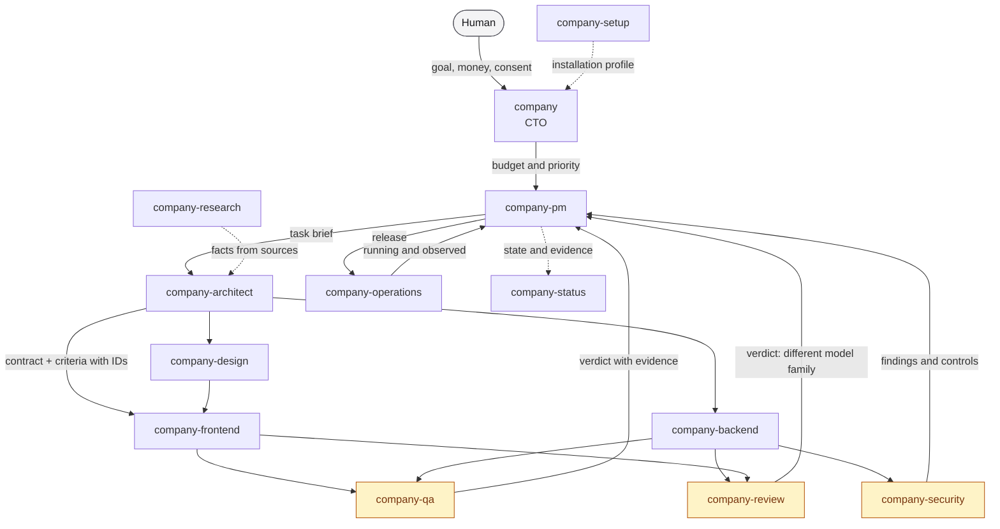
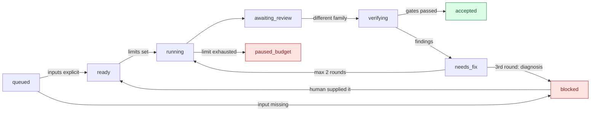

# Small Company Skills

Thirteen agent skills that turn one model into a small software company: a CTO, a PM, an architect,
developers, QA, review, security, design, operations. Each role has a closed scope of five action
categories, states what it needs, and **refuses what is not its own** — naming whose it is.

They are small, portable and model-agnostic. Every skill is a directory with a single `SKILL.md` and no
dependency on anything outside its own folder, so you can take one and leave the rest.

## Installation

**As a Claude Code plugin** — the whole set as a managed bundle:

```
/plugin marketplace add gog-line/small-company-skills
/plugin install small-company-skills@small-company-skills
```

**By hand** — copy the skills you want and edit them freely:

```bash
cp -R skills/company-pm ~/.claude/skills/          # globally
cp -R skills/company-pm <project>/.claude/skills/  # per project
```

Pick one route. Installing both leaves you with every skill twice.

## The thirteen roles

The table is generated from the skills themselves (`node scripts/skills.mjs table`), so it cannot drift
away from what they say.

| Skill | What it is | Five action categories |
| --- | --- | --- |
| [`company`](skills/company/SKILL.md) | You are the CTO: you run a portfolio of projects, not a single project. You do not implement, do not review, and do not take over the PM's work inside a project. | `cto.1` Set the company's goal and boundaries; `cto.2` Prioritise projects; `cto.3` Assign budgets to PMs; `cto.4` Share permitted knowledge; `cto.5` Settle escalations between projects |
| [`company-architect`](skills/company-architect/SKILL.md) | You are the architect of one project: you turn a goal and its criteria into a technical design that can be implemented and checked. You do not implement it yourself and you do not issue a review verdict. | `arch.1` Model the domain; `arch.2` Set boundaries and patterns; `arch.3` Design contracts; `arch.4` Split the technical work; `arch.5` Settle integration and diagnosis |
| [`company-backend`](skills/company-backend/SKILL.md) | You are the backend developer on one task: you deliver a domain rule and its entry point together with tests. You do not change the contract or the acceptance criteria, and you do not review anyone else's code. | `be.1` Implement the domain and the API; `be.2` Handle data and migrations; `be.3` Apply validation and authorisation; `be.4` Write and run tests; `be.5` Fix and report your own scope |
| [`company-design`](skills/company-design/SKILL.md) | You are the experience designer on one project: you establish what the user has to achieve and how the interface lets them do it. You do not implement the interface and you do not change acceptance criteria. | `ux.1` Design the user journey; `ux.2` Define states and accessibility; `ux.3` Set the visual direction; `ux.4` Specify components and tokens; `ux.5` Assess the usability of what was built |
| [`company-frontend`](skills/company-frontend/SKILL.md) | You are the frontend developer on one task: you deliver an interface change together with its tests. You do not change the contract or the acceptance criteria, and you do not review anyone else's code. | `fe.1` Implement the UI; `fe.2` Handle states and accessibility; `fe.3` Integrate the agreed contract; `fe.4` Write and run tests; `fe.5` Fix and report your own scope |
| [`company-operations`](skills/company-operations/SKILL.md) | You are the operations role on one project: you deliver a repeatable build, a release, observability and restoration. You do not change product code and you do not decide about production on your own. | `ops.1` Prepare the build and CI; `ops.2` Manage the environment within the assigned scope; `ops.3` Prepare the release; `ops.4` Monitor and diagnose; `ops.5` Check backups and restoration |
| [`company-pm`](skills/company-pm/SKILL.md) | You are the PM of one project: you take it from its goal to accepted results. You do not write or review code. | `pm.1` Run scope and backlog; `pm.2` Choose and hire roles; `pm.3` Assign and coordinate work; `pm.4` Accept results through gates; `pm.5` Keep memory, blockers and resumption |
| [`company-qa`](skills/company-qa/SKILL.md) | You are QA for one task: you check whether the result does what it was meant to do, on the running application. You do not write production code and you do not fix the defects you find. | `qa.1` Plan scenarios; `qa.2` Specify the test data; `qa.3` Check the running application; `qa.4` Reproduce defects; `qa.5` Issue a verdict with evidence |
| [`company-research`](skills/company-research/SKILL.md) | You are the researcher on one brief: you deliver facts from sources that can be checked, together with a list of what you did not confirm. You do not make the technical decision and you do not replace a source with your own confidence. | `res.1` Sharpen the research question; `res.2` Find the sources; `res.3` Check versions and currency; `res.4` Compare the evidence; `res.5` Deliver a manifest of facts and gaps |
| [`company-review`](skills/company-review/SKILL.md) | You assess someone else's change. You do not edit code, tests or criteria; you write only the report. | `review.1` Check scope and authors; `review.2` Assess correctness; `review.3` Assess architecture and maintainability; `review.4` Report reproducible findings; `review.5` Verify their resolution |
| [`company-security`](skills/company-security/SKILL.md) | You are the security role on one project: you establish what is protected, against what, by which controls, and whether they work. You do not implement fixes and you do not close the gate yourself. | `sec.1` Profile the risk; `sec.2` Model threats with the architect; `sec.3` Define the required controls; `sec.4` Verify controls in a permitted environment; `sec.5` Assess vulnerabilities and their outcome |
| [`company-setup`](skills/company-setup/SKILL.md) | You prepare the installation profile: what is available here, what it is fit for, and under which limits. You do not start projects and you do not change host configuration without consent taken right before the write. | `setup.1` Discover the available CLIs, models and pools; `setup.2` Check capability on a small sample; `setup.3` Record the profile: roles, models, limits; `setup.4` Choose one installation language; `setup.5` Confirm the profile with a canary and report gaps |
| [`company-status`](skills/company-status/SKILL.md) | You assemble a status panel only from what has been recorded. You do not start work, do not change state and do not fill missing data with a guess. | `status.1` Gather the recorded evidence; `status.2` Assemble the panel from those records; `status.3` Distinguish degrees of delivery; `status.4` Show pool usage with the age of the sample; `status.5` Mark stale and unavailable data |

## How it works

Work moves through roles rather than through one agent that does everything. Each role has a closed
scope of five categories and **refuses** what is not its own — naming whose it is.



The yellow roles are **gates**: QA, review and security do not substitute for one another, and none
of them records the state "accepted" — the runtime does that once the conditions are met.

### Task lifecycle



**The most important edge here is `queued → blocked`.** A skill missing a required input does not
guess and does not "do what it can" — it returns `blocked`, the list of gaps, and who has to supply
them. That is measured by the behaviour tests, not asserted in documentation.

## What these skills do NOT do

Gates — reviewer family, limits, the write boundary, model identity — are enforced by a runtime that
is not in this repository. A skill run standalone returns a plan, an assessment, or a `blocked`
result with the list of what is missing. **Never the state "accepted".** That is deliberate.

## What else you need for this to work properly

These skills describe roles. On their own they work standalone — they will return a plan, an assessment
or `blocked` — but the full working loop needs things this repository does NOT contain. They are listed
because without them some of what these skills promise cannot be delivered, and that is better known
before adoption than after.

**1. A second model provider — a hard requirement, not a convenience.** `company-review` may pass a
change only when the reviewer comes from a **different model family than the code's author**. With
access to a single provider, the reviewer has to disqualify itself and can give auxiliary notes, never a
pass. What we used while building these skills: OpenAI through the Codex CLI, Grok and others through
the Cursor CLI, Gemini through Antigravity. Any two independent lineages will do.

**2. A way to run the reviewer in isolation.** An external model with access to your mail, drive and
plugins is not a reviewer, it is an exposure. You need a separate working directory, MCP servers and
plugins disabled for the duration, **a canary that ATTEMPTS to reach what is supposed to be closed**,
and restoration afterwards. A refusal alone is not enough — you need to know WHAT refused, because a
refusal caused by someone else's authentication disappears the day that provider fixes it.

**3. Fuel measured, not estimated.** `company-pm` and `company` hand out finite limits and will not
start autonomous work without one. You need something that reports real pool usage **and the age of the
measurement** — otherwise the limits are fiction and the agent learns it ran out halfway through a task.

**4. A current model catalogue.** Model identifiers go stale within weeks. Before assigning work to a
named model, check that it still exists — a name taken from memory rather than from the catalogue has
already cost us several failed calls.

**5. A host that can run the behaviour tests.** `tests/skills-behaviour/` is here, but it needs a host
with a closeable tool allowlist (we used Claude Code with `--tools "Read,Glob,Grep"`). Without one you
can check a skill's structure, but not what it ACTUALLY does when an input is missing.

**6. A runtime that enforces the gates — absent from this repository.** Reviewer family, limits, the
write boundary and model identity are meant to be enforced by an execution layer. Until it exists, the
skills name the gates and refuse verdicts they have no right to issue, but nothing compels them.

### Recommended specifics

As of September 2026 — what we used ourselves while building and checking these skills, together with
what tripped us up on each. **Model identifiers go stale within weeks**, so treat them as an example of
the tier, not as a list to copy.

| For what | Recommendation | What we learned the hard way |
| --- | --- | --- |
| Host for skills and behaviour tests | **Claude Code** | the only one where we could close the tool list (`--tools "Read,Glob,Grep"`); a CLOSED allowlist, not a denylist — the denylist left within reach tools nobody had thought of |
| Adversarial review (GPT family) | **Codex CLI** (OpenAI), a reasoning-tier model at high effort | by default it sees the user's accounts and apps; needs a temporary `CODEX_HOME` holding only `auth.json`, `features.*` switched off and a `read-only` sandbox |
| Adversarial review (Grok family) | **Cursor CLI** (`cursor-agent`), e.g. `cursor-grok-4.6-high` | the most expensive pool of the three, so one order and no exploratory rounds; its plugin catalogue changes DURING a run, so disabling a snapshot is a race — you need a loop that repeats until the canary comes back clean |
| Second opinion and facts from code (Gemini family) | **Antigravity** (`agy`), e.g. `gemini-3.1-pro-high` | a separate billing pool, so it does not eat the Anthropic limit; in headless mode it auto-denies its own `read_file`/`command` permissions, and the only alternative is blanket tool approval — not worth granting for an auxiliary opinion |
| Checking whether a library or API still exists | **Perplexity** or any source with citations and live search | three language models are not three sources: they share a corpus and will repeat the same stale error with differing confidence |
| Running the validator and the tests | **Node.js ≥ 22** | no external dependencies — `node --test` and nothing else |

The minimum for `company-review` to be able to pass anything: **a host plus one provider from a
different family than the code's author.** The rest of the table raises quality; that one is the
necessary condition.

## State of the evidence

Stated plainly, because how far you can trust these skills depends on it.

| Skills | Structural checks | Behaviour evidence |
| --- | --- | --- |
| `company-pm`, `company-review` | yes | yes — 24 runs, two independent reviews, parity recorded |
| `company-security`, `company-setup`, `company` | yes | yes — 36 runs, equivalence judged by an independent model family |
| the other 8 | yes | **no** — a deliberate cost decision, not an oversight |

Behaviour evidence means: the skill run in an isolated directory with a closed tool allowlist, on the
same inputs, two attempts per variant — with the result judged by a model from a different family than
the author, on the raw records rather than on a summary.

## Development

```bash
node scripts/skills.mjs check      # structure, portability, category ids, protocol drift
node scripts/skills.mjs sync       # regenerate the shared protocol block in every SKILL.md
node scripts/skills.mjs table      # the roles table above
node --test scripts/*.test.mjs     # 25 validator tests + 14 input-gate tests
```

The shared behavioural protocol lives once, in `skills/_shared/protocol.md`, and is generated into every
`SKILL.md` between markers. Editing a copy by hand is detected as drift rather than left to be found by
eye. `tests/skills-behaviour/` holds the cases and the runner that check what a skill actually does when
an input is missing — see its README.

Requires Node.js 22 or newer. No dependencies.

Every push runs the same checks in CI (`.github/workflows/check.yml`), including one the local commands
do not make obvious: it runs `sync` and then fails if anything changed, which catches a protocol block
edited by hand instead of generated.

The skills follow the [Agent Skills](https://agentskills.io) format: a folder with a `SKILL.md` whose
frontmatter carries `name` and `description`. Nothing host-specific lives in this repository, so the
same folders work outside Claude Code.

## Licence

MIT.
